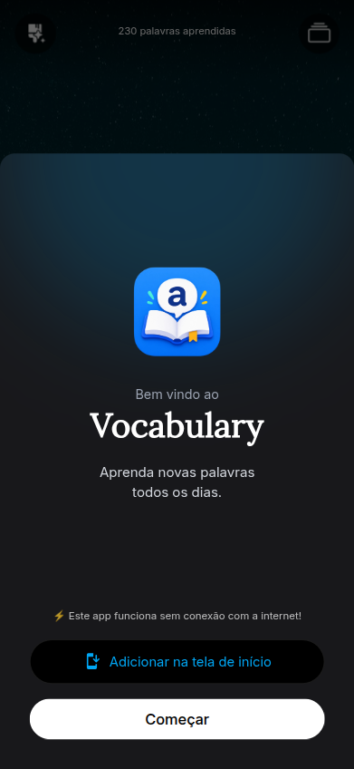
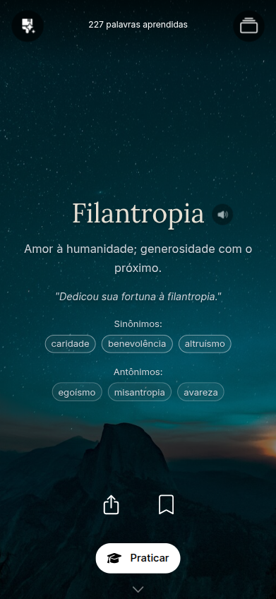
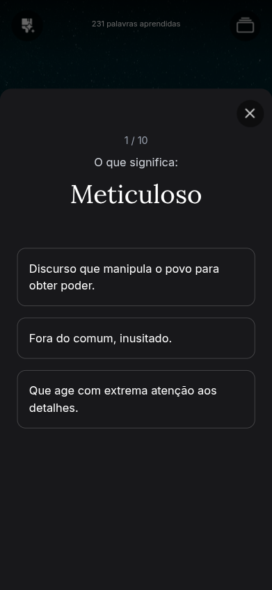
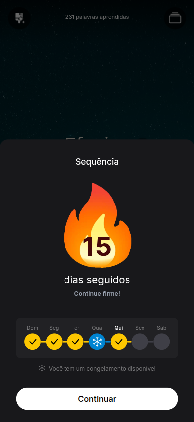

#  Vocabulary

Um web app para aprender novas palavras em formato de feed vertical, similar ao TikTok.

| Onboarding | Feed | Prática | Sequência |
|--|--|--|--|
|||||


## Funcionalidades

- ✅️ 📚 Feed vertical de palavras com suas definições
- ✅️ 🔊 Pronúncias
- ✅️ 💾 Salvar palavras
- ✅️ 🖼️ Compartilhar palavras como imagem
- ✅️ 🎨 Temas customizáveis
- ✅️ 🎓 Exercícios de prática e revisão
- ✅️ 🗓️ Sequências
- ✅️ 📲 Instalar web app na homescreen
- ✅️ ⚡️ Funcionamento Off-line!
- [ ] 🏷️ Seguir tópicos e categorias de palavras
- [ ] 🌐 Internacionalização

## Stack

- Vue
- TypeScript
- TailwindCSS
- Pinia
- Vite
- Bun
- Swiper

## Iniciar localmente

```bash
bun install
bun run dev
```

O app estará disponível em [http://localhost:5173](http://localhost:5173/) no navegador.

## Gerar novas palavras

Este projeto possui uma skill local em `.agents/skills/new-words/SKILL.md` que é carregada pelo seu agente de IA para instruí-lo sobre as regras de geração de novas palavras.

Você pode simplesmente pedir `"Gere 100 novas palavras"` para seu agente.
